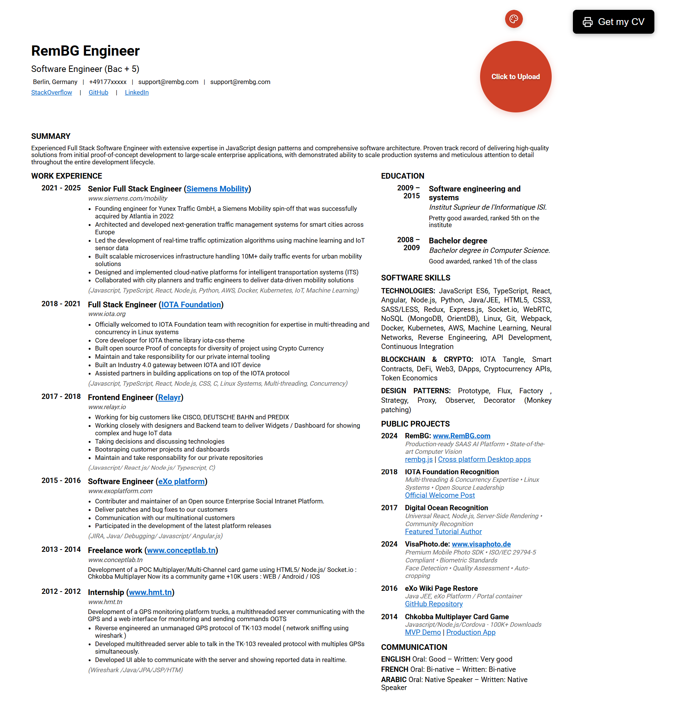
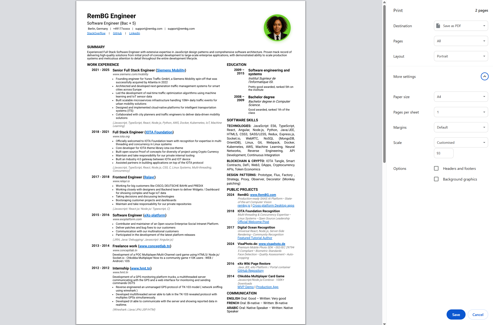
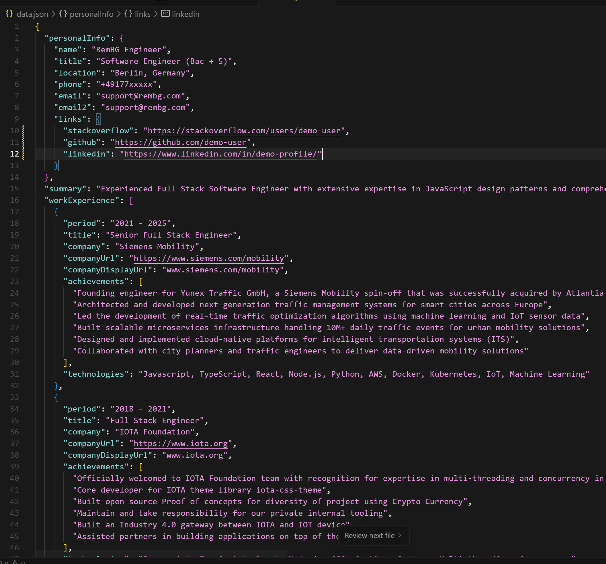

# RemBG CV Maker

A JSON-driven CV generator with AI background removal. Upload a profile photo and the background is automatically removed using RemBG.com API.







## Features

- **Background Removal**: AI-powered background removal for profile photos
- **Dynamic Content**: CV content loaded from `data.json`
- **Color Customization**: Customize profile photo border colors
- **Print-Ready**: Optimized for A4 printing (0.94 scale)
- **File Upload**: Support for JPG, PNG, WebP images (10MB max)

## Quick Start

### 1. Install Dependencies
```bash
npm install
```

### 2. Configure Environment Variables
Create a `.env` file and add your RemBG API key:
```bash
# Create .env file
touch .env
```

Edit `.env` and add your RemBG API key:
```
REMBG_API_KEY=your_actual_api_key_here
PORT=3000
```

Get your API key from [RemBG.com](https://www.rembg.com)

### 3. Start the Server
```bash
npm start
```

### 4. View Your CV
Open your browser and go to: `http://localhost:3000`

### 5. Upload Profile Photo
1. Click on the profile photo area
2. Select an image (JPG, PNG, WebP)
3. Background is automatically removed
4. Use color picker to change border color
5. Print with "Get my CV" button

## Available Scripts

- `npm start` - Start the production server
- `npm run dev` - Start development server with live reload
- `npm run server` - Alternative way to start the server

## Project Structure

```
cv/
├── data.json              # CV content data
├── server.js              # Express.js server with background removal API
├── index.html             # Main CV page with image upload interface
├── styles.css             # CSS styles with color customization
├── package.json           # Dependencies including RemBG.js
├── .env                   # Environment variables (create this file)
├── .gitignore             # Git ignore file (includes .env and uploads/)
├── uploads/               # Directory for processed profile images
├── assets/                # Demo images and assets
└── README.md              # This documentation
```

## Environment Variables

- `REMBG_API_KEY` - RemBG API key (required)
- `PORT` - Server port (default: 3000)

Example `.env` file:
```
REMBG_API_KEY=rembg_1234567890abcdef
PORT=3000
```

## API Endpoints

- `GET /` - Main CV page
- `GET /api/cv-data` - CV data
- `POST /api/upload-profile-image` - Upload and process profile image
- `DELETE /api/remove-profile-image` - Remove profile image
- `GET /health` - Health check

**POST /api/upload-profile-image**
- Content-Type: `multipart/form-data`
- Body: `profileImage` (file)
- Response: `{ "success": true, "imageUrl": "/uploads/profile-1234567890-nobg.png" }`

## Background Removal

Upload a profile photo and the background is automatically removed using RemBG.com API.

**Supported formats**: JPG, PNG, WebP (max 10MB)
**Processing time**: 2-5 seconds
**Output**: PNG with transparent background
**Storage**: `/uploads` directory

## Updating CV Content

To update your CV, simply edit the `data.json` file. The structure includes:

### Personal Information
```json
{
  "personalInfo": {
    "name": "Your Name",
    "title": "Your Title",
    "location": "Your Location",
    "phone": "Your Phone",
    "email": "Your Email",
    "email2": "Secondary Email",
    "links": {
      "stackoverflow": "https://...",
      "github": "https://...",
      "linkedin": "https://..."
    }
  }
}
```

### Work Experience
```json
{
  "workExperience": [
    {
      "period": "2021 - 2025",
      "title": "Job Title",
      "company": "Company Name",
      "companyUrl": "https://company.com",
      "companyDisplayUrl": "company.com",
      "achievements": ["Achievement 1", "Achievement 2"],
      "technologies": "Tech stack used"
    }
  ]
}
```

### Education
```json
{
  "education": [
    {
      "period": "2009 – 2015",
      "degree": "Degree Name",
      "school": "School Name",
      "description": "Additional details"
    }
  ]
}
```

### Skills
```json
{
  "skills": {
    "technologies": "List of technologies",
    "blockchain": "Blockchain skills",
    "designPatterns": "Design patterns"
  }
}
```

### Public Projects
```json
{
  "publicProjects": [
    {
      "year": "2024",
      "title": "RemBG - AI Background Removal",
      "url": "https://www.rembg.com",
      "displayUrl": "www.rembg.com",
      "description": "AI-powered background removal API with state-of-the-art computer vision",
      "links": [
        {
          "text": "GitHub Repository",
          "url": "https://github.com/Remove-Background-ai/rembg.js"
        }
      ]
    }
  ]
}
```

### Languages
```json
{
  "languages": [
    {
      "name": "ENGLISH",
      "oral": "Good",
      "written": "Very good"
    }
  ]
}
```

## Development

- **Frontend**: `CVLoader` class loads data from API, `ProfileImageUploader` handles image uploads
- **Backend**: Express.js server with multer for file handling
- **AI Processing**: RemBG.js SDK for background removal
- **Storage**: Local file system with automatic cleanup

## Production Deployment

1. Install dependencies: `npm install`
2. Configure environment variables in `.env`
3. Start the server: `npm start`

## Troubleshooting

**Image processing fails**: Check `REMBG_API_KEY` in `.env` file
**Upload fails**: Check file size (max 10MB) and format (JPG, PNG, WebP)
**Print issues**: Use Chrome with 0.94 scale and enable "Background graphics"
**Server won't start**: Check port availability and `.env` file

## Benefits

- **Easy Updates**: Edit JSON file to update CV content
- **Background Removal**: Automatic AI-powered background removal
- **Print Ready**: Optimized for A4 printing
- **Version Control**: JSON data can be tracked in git

## Printing

**Chrome Print Settings:**
1. Press Ctrl+P (or Cmd+P on Mac)
2. Set scale to **0.94** for perfect A4 fitting
3. Enable "Background graphics" for colors
4. Layout: Portrait, Paper: A4

## Related Projects

- [RemBG.com](https://www.rembg.com) - AI Background Removal API
- [rembg.js](https://github.com/Remove-Background-ai/rembg.js) - JavaScript SDK

